# Deep Research Pipeline

An automated research pipeline built with LangGraph that breaks down complex research questions into topics, generates subquestions, searches for sources, and synthesizes comprehensive reports with recursive expansion.

## 📋 Requirements

- Python 3.8+
- OpenAI API key
- Exa API key or Tavily API key

## 🛠️ Installation

```bash
git clone <your-repo-url>
cd deepresearch
pip install -r requirements.txt
cp .env.example .env
# Edit .env with your API keys
```

## 🔧 Configuration

Create `.env` file:
```env
OPENAI_API_KEY=your_openai_api_key_here
EXA_API_KEY=your_exa_api_key_here
TAVILY_API_KEY=your_tavily_api_key_here
```


## 🚀 Usage

### Basic Usage
```bash
python main.py --query "What are the latest developments in renewable energy?"
```

### Advanced Configuration
```bash
# High detail research with recursive expansion
python main.py --query "Climate change impacts" \
  --detail high \
  --depth 3 \
  --max-expansions 4 \
  --legend

# Custom models and search provider
python main.py --query "AI in healthcare" \
  --topic-model gpt-4o-mini \
  --summary-model gpt-4o \
  --search-provider tavily \
  --max-workers 8
```

## 📊 Command Line Options

| Option | Description | Default |
|--------|-------------|---------|
| `--query` | Research question (required) | - |
| `--detail` | Detail level: low/medium/high | medium |
| `--depth` | Research depth (1-10) | 1 |
| `--max-expansions` | Recursive expansion rounds | 3 |
| `--max-workers` | Parallel workers | 4 |
| `--search-provider` | Search provider: exa/tavily | exa |
| `--topic-model` | Model for topic generation | gpt-4o |
| `--summary-model` | Model for synthesis | gpt-4o |
| `--legend` | Add table of contents | False |


## 📊 Evaluation System

The pipeline includes a comprehensive evaluation system to assess research report quality:

### Evaluation Metrics

| Metric | Description | Score Range |
|--------|-------------|-------------|
| **Citation Completeness** | Tracks citation distribution, source coverage, and citation efficiency | 0-100 |
| **Content Depth** | Measures word count, fact density, topic balance, and information richness | 0-100 |
| **Source Quality** | Evaluates source diversity, authority domains, recency, and credibility | 0-100 |
| **Structural Quality** | Assesses section completeness, formatting consistency, and organization | 0-100 |
| **Narrative Coherence** | Uses LLM to evaluate logical flow, integration quality, and academic tone | 0-100 |
| **Factual Consistency** | Identifies contradictions, inconsistencies, and conflicting claims | 0-100 |

### Evaluation Features

- **Citation Analysis**: Tracks citation distribution across topics, identifies missing/unused citations
- **Content Metrics**: Word count, fact density, topic balance, and information distribution
- **Source Assessment**: Authority domains, recency, diversity, and credibility scoring
- **Structural Review**: Section completeness, formatting consistency, and organization quality
- **LLM-Powered Analysis**: Narrative coherence and factual consistency evaluation
- **Comprehensive Scoring**: Weighted overall score with detailed breakdown

### Usage

```bash
# Evaluate a single report
python evaluator.py research_report_20250625_120911.md

# Batch evaluation of multiple reports
python run_eval.py

# Quick evaluation with custom model
python evaluator.py report.md --model gpt-4o --output results.json
```

## 🏗️ Architecture

```mermaid
graph TD
    %% Main Pipeline Nodes
    A[📋 Extract Topics<br/>Breaks down research question] --> B[❓ Generate Subquestions<br/>Creates specific questions]
    B --> C[🔄 Follow-up Generator<br/>Analyzes results for new questions]
    C --> D[🔍 Search Node<br/>Finds relevant sources]
    D --> E[⚙️ Iteration Controller<br/>Manages research depth]
    
    %% Conditional Flow
    E -->|Continue Research| C
    E -->|Complete| F[🧠 Article Synthesis<br/>with Expansion]
    
    %% Research Agent Subgraph
    subgraph "🔬 Research Agent"
        direction TB
        H[🚀 Recursive Expansion<br/>Generates follow-up questions]
        I[⚡ Parallel Search<br/>Concurrent source discovery]
        J[🔗 Content Integration<br/>Weaves new information]
        K[📝 Citation Management<br/>Tracks sources & citations]
        L[✨ Academic Formatting<br/>Natural narrative flow]
    end
    
    %% Research Agent Flow
    F --> H
    H --> I
    I --> J
    I --> K
    J --> L
    K --> L
    
    %% Final Report
    L --> G[📄 Generate Report<br/>Professional markdown output]
    
    %% Styling
    classDef mainNode fill:#e3f2fd,stroke:#1976d2,stroke-width:2px,color:#000
    classDef agentNode fill:#f3e5f5,stroke:#7b1fa2,stroke-width:2px,color:#000
    classDef controlNode fill:#fff3e0,stroke:#f57c00,stroke-width:2px,color:#000
    classDef reportNode fill:#e8f5e8,stroke:#388e3c,stroke-width:2px,color:#000
    
    class A,B,C,D mainNode
    class H,I,J,K,L agentNode
    class E controlNode
    class F,G reportNode
```


