# Deep Research Pipeline

An automated research pipeline built with LangGraph that breaks down complex research questions into topics, generates subquestions, searches for sources, and synthesizes comprehensive reports with recursive expansion.

## 📋 Requirements

- Python 3.8+
- OpenAI API key
- Exa API key or Tavily API key

## 🛠️ Installation

```bash
git clone https://github.com/Palashio/research.git
cd deepresearch
pip install -r requirements.txt
cp .env.example .env
# Edit .env with your API keys
```

## 🔧 Configuration

Create `.env` file:
```env
OPENAI_API_KEY=your_openai_api_key_here
EXA_API_KEY=your_exa_api_key_here
TAVILY_API_KEY=your_tavily_api_key_here
```


## 🚀 Usage

### Basic Usage
```bash
python main.py --query "What are the latest developments in renewable energy?"
```

### Advanced Configuration
```bash
# High detail research with recursive expansion
python main.py --query "Climate change impacts" \
  --detail high \
  --max-expansions 4 \
  --legend

# Custom models and search provider
python main.py --query "AI in healthcare" \
  --topic-model gpt-4o-mini \
  --summary-model gpt-4o \
  --search-provider tavily \
  --max-workers 8
```

## 📊 Command Line Options

| Option | Description | Default |
|--------|-------------|---------|
| `--query` | Research question (required) | - |
| `--detail` | Detail level: low/medium/high | medium |
| `--max-expansions` | Recursive expansion rounds | 3 |
| `--max-workers` | Parallel workers | 4 |
| `--search-provider` | Search provider: exa/tavily | exa | (must work with structured outputs)
| `--topic-model` | Model for topic generation | gpt-4o | (must work with structured outputs)
| `--summary-model` | Model for synthesis | gpt-4o |
| `--legend` | Add table of contents | False |


## 📊 Evaluation System

The pipeline includes a narrative coherence evaluation system to assess research report quality:

### Evaluation Metrics

The evaluator analyzes each section of the report and scores it on a 1-5 scale (converted to 0-100) across these dimensions:

| Metric | Description | Score Range |
|--------|-------------|-------------|
| **Logical Flow** | How well content flows from one paragraph to the next | 1-5 (20-100) |
| **Integration Quality** | How well information from multiple sources is integrated | 1-5 (20-100) |
| **Academic Tone** | How professional and scholarly the writing style is | 1-5 (20-100) |
| **Clarity** | How clear and understandable the content is | 1-5 (20-100) |
| **Coherence** | How well ideas connect and build upon each other | 1-5 (20-100) |

### Evaluation Features

- **Section-by-Section Analysis**: Evaluates each report section separately (introduction, topics, conclusion)
- **LLM-Powered Assessment**: Uses OpenAI models to provide detailed explanations for each score
- **Overall Scoring**: Calculates weighted average across all sections
- **JSON Output**: Saves detailed evaluation results with explanations

### Usage

```bash
# Evaluate a single report
python tests/evaluator.py research_report_20250625_120911.md

# Batch evaluation of multiple reports
python tests/run_eval.py

# Custom model and output path
python tests/evaluator.py report.md --model gpt-4o --output results.json
```

## 🏗️ Architecture

```mermaid
graph TD
    %% Main Pipeline Nodes
    A[📋 Extract Topics<br/>Breaks down research question] --> B[❓ Generate Subquestions<br/>Creates specific questions]
    B --> C[🔄 Follow-up Generator<br/>Analyzes results for new questions]
    C --> D[🔍 Search Node<br/>Finds relevant sources]
    D --> E[⚙️ Iteration Controller<br/>Manages research depth]
    
    %% Conditional Flow
    E -->|Continue Research| C
    E -->|Complete| F[🧠 Article Synthesis<br/>with Expansion]
    
    %% Research Agent Subgraph
    subgraph "🔬 Research Agent"
        direction TB
        H[🚀 Recursive Expansion<br/>Generates follow-up questions]
        I[⚡ Parallel Search<br/>Concurrent source discovery]
        J[🔗 Content Integration<br/>Weaves new information]
        K[📝 Citation Management<br/>Tracks sources & citations]
        L[✨ Academic Formatting<br/>Natural narrative flow]
    end
    
    %% Research Agent Flow
    F --> H
    H --> I
    I --> J
    I --> K
    J --> L
    K --> L
    
    %% Final Report
    L --> G[📄 Generate Report<br/>Professional markdown output]
    
    %% Styling
    classDef mainNode fill:#e3f2fd,stroke:#1976d2,stroke-width:2px,color:#000
    classDef agentNode fill:#f3e5f5,stroke:#7b1fa2,stroke-width:2px,color:#000
    classDef controlNode fill:#fff3e0,stroke:#f57c00,stroke-width:2px,color:#000
    classDef reportNode fill:#e8f5e8,stroke:#388e3c,stroke-width:2px,color:#000
    
    class A,B,C,D mainNode
    class H,I,J,K,L agentNode
    class E controlNode
    class F,G reportNode
```


